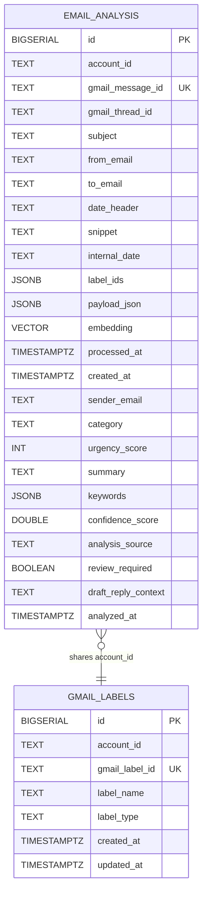

# ArrangeBox

ArrangeBox는 Gmail 메일을 동기화하고, AI 기반으로 분류한 뒤, 사용자가 한 번에 정리할 수 있도록 돕는 메일 트리아지 백엔드 프로젝트입니다. 읽지 않음/읽음 메일을 그룹화하고, 발신자와 카테고리 기준으로 메일을 정리하며, 보관, 삭제, 라벨 변경 같은 액션을 빠르게 수행할 수 있도록 설계했습니다.

프로젝트는 비동기 파이프라인 중심으로 동작합니다. Google OAuth로 Gmail에 접근한 뒤 메일을 가져오고, Kafka에 발행한 뒤 Worker가 분석을 수행하며, 결과는 PostgreSQL에 저장됩니다. 원문 payload는 Redis에 짧게 저장한 뒤 처리 후 제거해서 민감한 데이터를 오래 보관하지 않도록 구성했습니다.

## Feature

### 1. Google OAuth 로그인

설명:

- 여기에 로그인 데모 GIF를 넣어주세요.
- Google 계정으로 로그인하고 쿠키 기반 인증이 설정되는 흐름을 설명하면 좋습니다.

### 2. 받은편지함 동기화

설명:

- 여기에 동기화 데모 GIF를 넣어주세요.
- Gmail 메일을 가져와 Kafka 분석 파이프라인으로 전달하는 흐름을 설명하면 좋습니다.

### 3. AI 트리아지 미리보기

설명:

- 여기에 트리아지 화면 GIF를 넣어주세요.
- unread/read, 발신자 그룹, 카테고리 분류가 어떻게 보이는지 설명하면 좋습니다.

### 4. 메일 일괄 정리 액션

설명:

- 여기에 액션 데모 GIF를 넣어주세요.
- archive, trash, inbox 해제, 라벨 변경 동작을 설명하면 좋습니다.

### 5. Gmail 라벨 생성 및 적용

설명:

- 여기에 라벨 생성/적용 GIF를 넣어주세요.
- 사용자 라벨 생성과 메일 라벨 반영 흐름을 설명하면 좋습니다.

## Tech Stack

| 구분                      | 기술                             |
| ------------------------- | -------------------------------- |
| Backend                   | Python 3.12, FastAPI, Uvicorn    |
| Async / Networking        | asyncio, httpx                   |
| Auth / External API       | Google OAuth2, Gmail API         |
| Message Queue             | Kafka (KRaft), aiokafka          |
| Database                  | PostgreSQL 16, pgvector, asyncpg |
| Cache / Temporary Storage | Redis                            |
| AI                        | Gemini API                       |
| Validation                | Pydantic v2                      |
| Test                      | pytest                           |
| Infra / Local Dev         | Docker Compose                   |

## ERD

## Architecture

추천 다이어그램 흐름:

- Client
- FastAPI API Server
- Google OAuth / Gmail API
- Kafka Producer
- Kafka Consumer Worker
- Gemini API
- Redis
- PostgreSQL
